<div align="center">

# 💻 C Challenges Solved

### 🚀 A Journey Through Programming Excellence

[](https://github.com/said-boutayeb)
[](https://en.wikipedia.org/wiki/C_(programming_language))
[](https://www.42.fr/)
[](https://en.wikipedia.org/wiki/Morocco)


---

### 📊 Quick Stats

<table>
<tr>
<td align="center">

<br/>
<b>Collections</b>
</td>
<td align="center">

<br/>
<b>Total Exercises</b>
</td>
<td align="center">

<br/>
<b>Level 0</b>
</td>
<td align="center">

<br/>
<b>Level 1</b>
</td>
<td align="center">

<br/>
<b>Success Rate</b>
</td>
</tr>
</table>

</div>

---

## 🎯 About This Repository

> **"The only way to learn a new programming language is by writing programs in it."** - *Dennis Ritchie*

Welcome to my programming journey! This repository showcases my dedication to mastering C programming through carefully solved challenges. Each solution reflects my commitment to **clean code**, **efficiency**, and **best practices**.

### 🌟 Why This Repository?

```ascii
┌─────────────────────────────────────────────────────────┐
│  📚 Learning Resource    →  Study real solutions        │
│  🎓 Portfolio Showcase   →  Demonstrate skills          │
│  🤝 Community Sharing    →  Help fellow learners        │
│  📈 Progress Tracking    →  Document growth journey     │
└─────────────────────────────────────────────────────────┘
```

---

## 📂 Repository Structure

```
c-challenges-solved/
│
├── 🎯 42-piscine-practice/
│   ├── ✅ level_0/          # Fundamentals (11 exercises)
│   ├── 🔄 level_1/          # Core Concepts (17 exercises)
│   └── ⏳ level_3/          # Advanced Topics (Coming Soon)
│
└── 📄 README.md             # You are here!
```

<div align="center">

### 🗺️ Learning Roadmap

```mermaid
graph LR
    A[🌱 Beginner] -->|Level 0| B[✅ Completed]
    B -->|Level 1| C[🔄 In Progress]
    C -->|Level 2| D[⏳ Advanced]
    D -->|Level 3| E[🏆 Expert]

    %% 🎨 Custom Styling
    style A fill:#0f172a,stroke:#38bdf8,stroke-width:2px,color:#ffffff
    style B fill:#065f46,stroke:#10b981,stroke-width:2px,color:#ffffff
    style C fill:#facc15,stroke:#f59e0b,stroke-width:2px,color:#0f172a
    style D fill:#ef4444,stroke:#dc2626,stroke-width:2px,color:#ffffff
    style E fill:#111827,stroke:#38bdf8,stroke-width:2px,color:#ffffff

    %% ✨ Link Styling
    linkStyle 0 stroke:#94a3b8,stroke-width:2px
    linkStyle 1 stroke:#94a3b8,stroke-width:2px
    linkStyle 2 stroke:#94a3b8,stroke-width:2px
    linkStyle 3 stroke:#94a3b8,stroke-width:2px
```



</div>

---

## 🏆 Achievements & Milestones

<table>
<tr>
<td width="50%">

### ✅ Completed
- 🎉 **Level 0** - All 11 exercises solved
- 💪 Mastered `write()` system call
- 🔤 String manipulation expert
- 📝 Command-line argument handling
- 🎯 100% success rate maintained

</td>
<td width="50%">

### 🔄 In Progress
- 🚀 **Level 1** - 17 exercises ongoing
- 🔐 Cipher implementations (ROT13, ROT1)
- 🔀 Multiple solution approaches
- 🧠 Advanced string algorithms
- ⚡ Performance optimization

</td>
</tr>
</table>

<div align="center">

### 📈 Progress Visualization


| Level | Progress | Status |
|:-----:|:--------:|:------:|
| **Level 0** |  | ✅ Complete |
| **Level 1** |  | 🔄 Active |
| **Level 3** |  | ⏳ Planned |

</div>

---

## 🛠️ Tech Stack & Tools

<div align="center">

### Languages & Standards


### Development Environment

| Component | Technology |
|:---------:|:----------:|
| **Language** | C (C99/C11) |
| **Compiler** | GCC with `-Wall -Wextra -Werror` |
| **Standard** | 42 Norminette |
| **OS** | Linux/Unix |
| **Version Control** | Git & GitHub |

</div>

---

## 💡 Skills & Concepts

<div align="center">

<table>
<tr>
<td align="center" width="33%">

### 🧠 Core Programming
- Memory Management
- Pointer Manipulation
- String Operations
- Data Structures
- Algorithm Design

</td>
<td align="center" width="33%">

### 🔐 Advanced Topics
- Cipher Algorithms
- ROT13 Implementation
- ROT1 Encryption
- Pattern Matching
- Optimization Techniques

</td>
<td align="center" width="33%">

### 🎯 Best Practices
- Clean Code
- Code Documentation
- Testing & Debugging
- Performance Tuning
- Version Control

</td>
</tr>
</table>

</div>

---

## 📚 Challenge Collections

<details open>
<summary><h3>🎯 42 Piscine Practice</h3></summary>

<br/>

A progressive series of exercises from the renowned **42 School** curriculum, designed to build programming mastery from the ground up.

<div align="center">

| Level | Status | Exercises | Focus Area | Link |
|:-----:|:------:|:---------:|:----------:|:----:|
| **0** | ✅ Complete | 11/11 | Basic I/O & Fundamentals | [📖 View](42-piscine-practice/level_0/README.md) |
| **1** | 🔄 Active | 17 | String Functions & Algorithms | [📖 View](42-piscine-practice/level_1/README.md) |
| **3** | ⏳ Planned | TBD | Advanced Algorithms | Coming Soon |

</div>

#### 🌟 Level 0 - Fundamentals ✅

```
✓ Basic output operations      ✓ Parameter handling
✓ Number printing              ✓ Alphabet manipulation  
✓ Character filtering          ✓ Command-line arguments
```

#### 🚀 Level 1 - Core Concepts 🔄

```
○ String functions (ft_strlen, ft_strcpy, ft_putstr)
○ Algorithm challenges (FizzBuzz, first_word)
○ Cipher implementations (ROT13, ROT1)
○ Multiple solution approaches (repeat_alpha, rev_print)
○ Advanced string manipulation
```

</details>

---

## 🚀 Quick Start Guide

<div align="center">

### 📥 Clone & Setup

</div>

```bash
# Clone the repository
git clone https://github.com/said-boutayeb/c-challenges-solved.git

# Navigate to the project
cd c-challenges-solved

# Explore collections
ls -la 42-piscine-practice/
```

<div align="center">

### ⚙️ Compile & Run

</div>

```bash
# Navigate to specific level
cd 42-piscine-practice/level_0

# Compile with strict flags
gcc -Wall -Wextra -Werror hello.c -o hello

# Execute
./hello
```

<div align="center">

### 🧪 Testing Example

</div>

```bash
# Test with arguments
./first_word "Hello World"
# Output: Hello

# Test cipher
./rot_13 "Hello"
# Output: Uryyb

# Test function implementations
./ft_strlen "test"
# Returns: 4
```

---

## 🎓 Learning Resources

<div align="center">

### 📖 Recommended Reading

[](https://en.wikipedia.org/wiki/The_C_Programming_Language)
[](https://www.amazon.com/C-Programming-Modern-Approach-2nd/dp/0393979504)

### 🔗 Useful Links

| Resource | Description | Link |
|:---------|:------------|:----:|
| 🏫 **42 School** | Official 42 Network website | [Visit](https://www.42.fr/) |
| 📚 **C Reference** | Complete C documentation | [Visit](https://en.cppreference.com/w/c) |
| 🐧 **Man Pages** | Linux manual pages | [Visit](https://man7.org/linux/man-pages/) |
| 📖 **GNU C Library** | GCC library documentation | [Visit](https://www.gnu.org/software/libc/manual/) |

</div>

---

## 🤝 Community & Contribution

<div align="center">

### 💬 How Can You Help?

</div>

<table>
<tr>
<td align="center" width="25%">

<br/>
<b>🐛 Report Bugs</b>
<br/>
<sub>Found an issue?</sub>
</td>
<td align="center" width="25%">

<br/>
<b>💡 Suggest Ideas</b>
<br/>
<sub>Have improvements?</sub>
</td>
<td align="center" width="25%">

<br/>
<b>❓ Ask Questions</b>
<br/>
<sub>Need clarification?</sub>
</td>
<td align="center" width="25%">

<br/>
<b>⭐ Star Repo</b>
<br/>
<sub>Show support!</sub>
</td>
</tr>
</table>

<div align="center">

### 🌟 Show Your Support

If you find this repository helpful, please consider:

[](https://github.com/said-boutayeb/c-challenges-solved)
[](https://github.com/said-boutayeb)

</div>

---

## 📜 Code Standards

<div align="center">

### ✅ Quality Checklist

| Standard | Status |
|:---------|:------:|
| 42 Norminette Compliance | ✅ |
| Strict Compilation Flags | ✅ |
| No Warnings | ✅ |
| Memory Leak Free | ✅ |
| Edge Cases Handled | ✅ |
| Well Documented | ✅ |
| Optimized Performance | ✅ |

</div>

---

## 📫 Connect With Me

<div align="center">

### 🌐 Let's Connect!

[](https://github.com/said-boutayeb)
[](https://en.wikipedia.org/wiki/El_Jadida)

---

### 💼 Profile Stats


</div>

---

## 📝 License

<div align="center">

This project follows the [42 Unlicense](https://github.com/gcamerli/42unlicense) terms.

---

### 🎉 Thank You for Visiting!


---

**Made with ❤️ and lots of ☕ by Said Boutayeb**

*Last Updated: October 2025*


</div>
